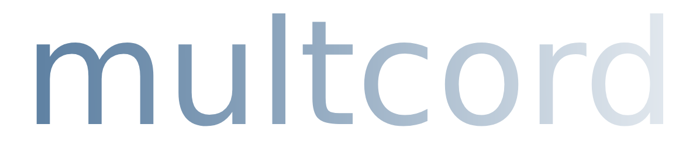

<div align="center">
  
</div>

> [!WARNING]
> Using selfbots is prohibited by the Discord TOS. This project serves as a proof-of-work and I take no responsibility for punished Discord accounts.

React App + Express.js Server for multi-channel Discord viewing experience.

## Overview

This project uses [aiko-chan-ai's discord.js-selfbot-v13](https://github.com/aiko-chan-ai/discord.js-selfbot-v13) package to view messages coming in and out of a Discord Client.

Clients connect to a websocket provided by a local server that reads and processes incoming traffic from a Discord Account. Clients also have the ability to subscribe/unsubscribe from different channels, and to view related server info (such as name, member count, channels).

## Installation

> [!NOTE]
> **Node.js 20.18.0 or newer is required**

### **1. Clone the repository**

```bash
git https://github.com/t0rrential/multcord.git
cd multcord
```

### **2. Install dependencies**

```bash
npm i
```

### **3. Setup Environment Variables**

In the main folder of the project, create an `.env` file and add your Discord token to it.

To find your Discord token, you can run this code snippet [here](https://github.com/aiko-chan-ai/discord.js-selfbot-v13#:~:text=Get-,Token,-%3F) in your Discord console (F12 on the website or Ctrl + Shift + I).

```bash
DISCORD_TOKEN = <your token here>
```

### **4. Run the Project**

This project uses [concurrently](https://www.npmjs.com/package/concurrently) to simultaneously run the React frontend and Express backend. After setting up your environment variables, you can start the project:

```bash
npm run start
```

If you want to run the frontend, run:

```bash
npm run start:frontend
```

Alternatively, if you only want to run the backend, run:

```bash
npm run start:backend
```

